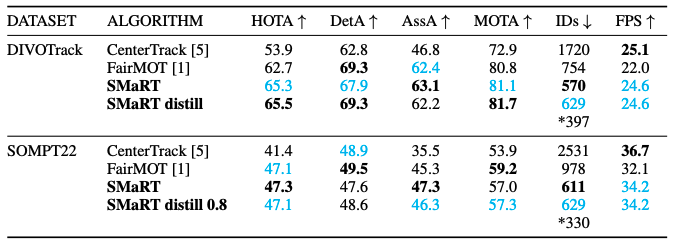
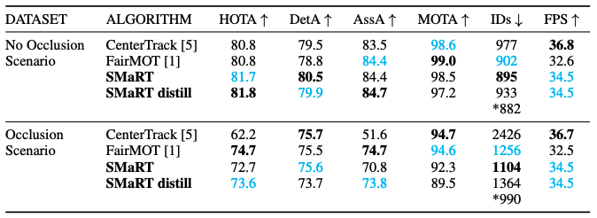
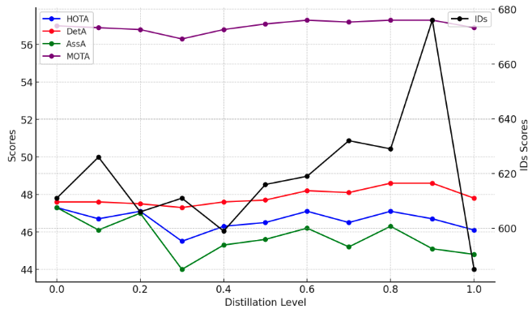

# SMaRT (Stick via Motion and Recognition Tracker)
Simultaneous object detection and tracking using displacement and ReID vectors:

> [**SOMPT22**](https://arxiv.org/abs/2208.02580),            
> Fatih Emre Simsek, Dr. Cevahir Cigla, Prof. Dr. Koray Kayabol,        
> *arXiv technical report ([arXiv 2208.02580](https://arxiv.org/abs/2208.02580))*  

    @article{smarttracking,
      title={SMaRT},
      author={Fatih Emre Simsek, Dr. Cevahir Cigla, Prof. Dr. Koray Kayabol},
      journal={},
      year={2024}
    }

Contact: [simsekfe@gmail.com](mailto:simsekfe@gmail.com). Any questions or discussion are welcome! 

## Abstract
This paper presents SMaRT (Stick via Motion and Recognition Tracker), a novel multi-object tracking (MOT) approach that integrates motion estimation and re-identification within a unified, efficient framework. Inspired by leading MOT methods like CenterTrack and FairMOT, SMaRT enhances tracking robustness by fusing re-identification features from an advanced teacher-student model. This integration enables the simultaneous regression of object locations and extraction of re-identification vectors within a single neural network. Evaluations on the SOMPT22 and DIVOTrack datasets demonstrate significant improvements over previous state-of-the-art methods in terms of Higher Order Tracking Accuracy (HOTA), Multi-Object Tracking Accuracy (MOTA), and Association Accuracy (AssA). Additionally, SMaRT's efficiency and accuracy are validated through comprehensive synthetic video experiments, highlighting its adaptability to varied motion patterns and occlusions. The proposed approach offers a robust, accurate, and efficient solution for real-world applications such as surveillance, autonomous driving, and robotics.

## Features at a glance

- Performing object detection, extracting embeddings, and conducting displacement regression as part of an end-to-end multi-task learning framework.

- Knowledge distillation by using re-identification vectors (soft label) generated by teacher ReID network as ground-truth on student model SMaRT to improve sub-optimal embedding extraction task. When producing soft labels with a teacher model, there is no need for a temporal relationship between frames. This allows detection datasets to be used in tracker training because tracking IDs that are followed across frames are not required.

- Introducing a simulation suite to create human motion synthetic videos to analyze multi object trackers.

- SMaRT, has outperformed the FairMOT algorithm by 2.6/0.2\% and the CenterTrack algorithm by 11.4/5.5\%  in terms of the HOTA (Higher Order Tracking Accuracy) score on DIVOTrack SOMPT22 datasets respectively.

## Main results

### Benchmarking of MOT Algorithms for two MOT datasets (Bold are the best, cyan are the second. * are the number of ground truth IDs.Distill stands for knowledge distillation)

### Benchmarking of MOT Algorithms for two Synthetic datasets (Bold are the best, cyan are the second. * are the number of ground truth IDs. Distill stands for knowledge distillation)

### Comparison of Tracking Metrics Across Distillation Levels on SOMPT22 Dataset

## Installation

Please refer to [INSTALL.md](readme/INSTALL.md) for installation instructions.

## Use SMaRT

We support demo for videos, webcam, and image folders. 

If you want to test with person tracking models, you need to add `--num_class 1`:

~~~
python demo.py tracking,embedding --load_model ../models/sompt22.pth --num_class 1 --demo /path/to/image/or/folder/or/video 
~~~

For webcam demo, run     

~~~
python demo.py tracking,embedding --load_model ../models/sompt22.pth --num_class 1 --demo webcam 
~~~

The result for the example images should look like:

You can add `--debug 2` to visualize the heatmap and offset predictions.

## Benchmark Evaluation and Training

After [installation](readme/INSTALL.md), follow the instructions in [DATA.md](readme/DATA.md) to setup the datasets. Then check [GETTING_STARTED.md](readme/GETTING_STARTED.md) We provide scripts for all the experiments in the [experiments](experiments) folder.

## License

SMaRT is developed upon [CenterNet](https://github.com/xingyizhou/CenterNet) and [CenterTrack](https://github.com/xingyizhou/CenterTrack). Both codebases are released under MIT License themselves. Some code of CenterNet are from third-parties with different licenses, please check the CenterNet repo for details. In addition, this repo uses [TrackEval](https://github.com/JonathonLuiten/TrackEval.git) for MOT evaluation. See [NOTICE](NOTICE) for detail. Please note the licenses of each dataset. Most of the datasets we used in this project are under non-commercial licenses.

