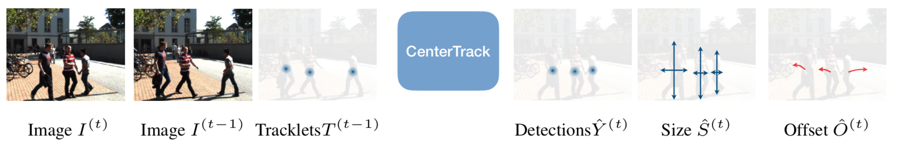
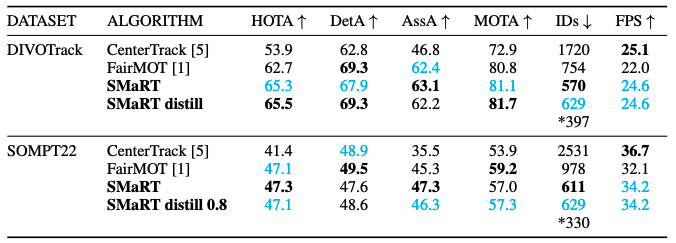
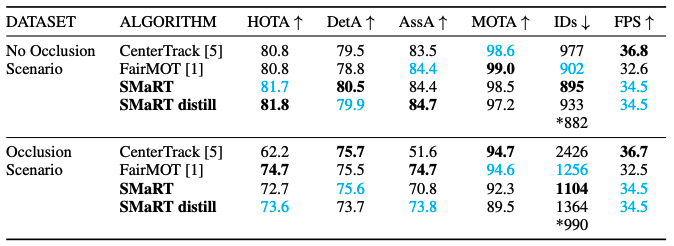
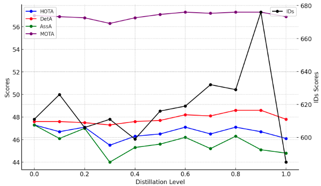
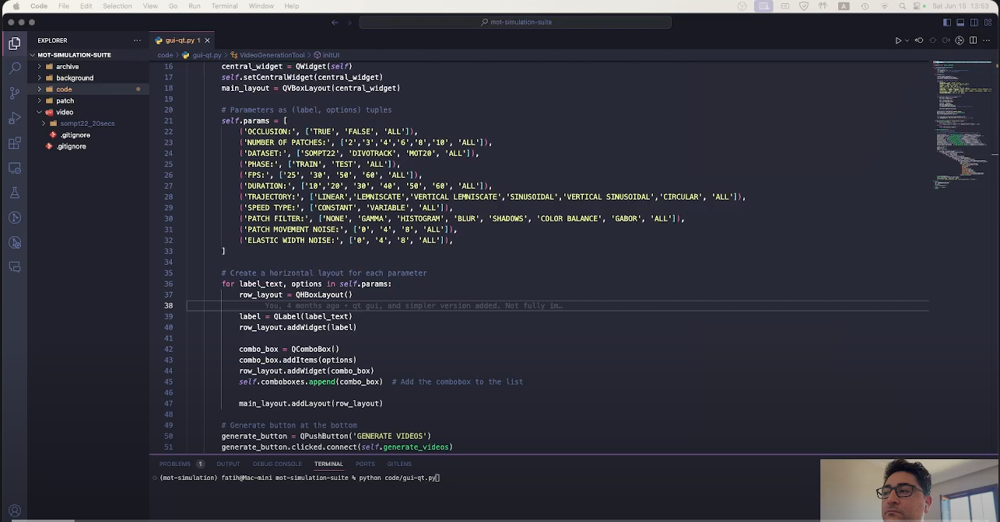

# SMaRT — Stick via Motion and Recognition Tracker

Simultaneous object detection and tracking using displacement and ReID vectors.



> **SOMPT22** — Fatih Emre Simsek, Dr. Cevahir Cigla, Prof. Dr. Koray Kayabol
> *arXiv technical report ([arXiv 2208.02580](https://arxiv.org/abs/2208.02580))*

Contact: [simsekfe@gmail.com](mailto:simsekfe@gmail.com)

---

## Table of Contents

1. [Abstract](#abstract)
2. [Features](#features-at-a-glance)
3. [Results](#main-results)
4. [Installation](#installation)
   - [Linux / CUDA (recommended)](#option-a-linux--cuda-recommended)
   - [Apple Silicon M1/M2/M3 (native MPS)](#option-b-apple-silicon-m1m2m3-native-mps)
   - [Docker](#option-c-docker)
   - [Google Colab](#option-d-google-colab)
5. [Pretrained Models](#pretrained-models)
6. [Dataset Preparation](#dataset-preparation)
7. [Training](#training)
8. [Inference & Demo](#inference--demo)
9. [Benchmark Evaluation](#benchmark-evaluation)
10. [MOT Simulation Suite](#mot-simulation-suite)
11. [Citation](#citation)
12. [License](#license)

---

## Abstract

SMaRT integrates motion estimation and re-identification within a unified, efficient framework. Inspired by CenterTrack and FairMOT, SMaRT enhances tracking robustness by fusing re-identification features from a teacher-student model, enabling simultaneous regression of object locations and extraction of ReID vectors in a single neural network. Evaluations on SOMPT22 and DIVOTrack demonstrate significant improvements in HOTA, MOTA, and AssA over prior state-of-the-art methods.

---

## Features at a Glance

- **End-to-end multi-task learning** — detection, embedding extraction, and displacement regression in one pass.
- **Knowledge distillation** — ReID vectors from a teacher network serve as soft labels, allowing detection datasets (without tracking IDs) to be used in training.
- **MOT Simulation Suite** — synthetic video generation for controlled analysis of tracker behavior under varied motion patterns and occlusions.
- SMaRT outperforms FairMOT by **2.6 / 0.2 %** and CenterTrack by **11.4 / 5.5 %** HOTA on DIVOTrack / SOMPT22.

---

## Main Results

### MOT Dataset Benchmarks

> Bold = best, cyan = second best. `*` = number of ground-truth IDs. "Distill" = knowledge distillation variant.



### Synthetic Dataset Benchmarks



### Distillation Level Comparison on SOMPT22



---

## Installation

### Requirements (all platforms)

- Python 3.10
- PyTorch ≥ 1.13 (CUDA) or ≥ 2.1 (MPS / CPU)
- numpy == 1.23.5 (pinned — numba compatibility)

---

### Option A: Linux / CUDA (recommended)

Tested on Ubuntu 20.04, CUDA 11.6, PyTorch 1.13.1.

**1. Create conda environment**

```bash
conda create --name smart python=3.10
conda activate smart
```

**2. Install PyTorch + CUDA**

```bash
conda install pytorch==1.13.1 torchvision==0.14.1 torchaudio==0.13.1 \
    pytorch-cuda=11.6 -c pytorch -c nvidia
```

**3. Install build tools**

```bash
conda install cython ninja
conda install cudatoolkit-dev -c conda-forge
pip install python-dev-tools --user --upgrade
pip install numpy==1.23.5
```

**4. Install Python dependencies**

```bash
pip install -r requirements.txt
```

**5. Build DCNv2 (Deformable Convolution)**

```bash
cd src/lib/model/networks/DCNv2
python setup.py build develop
cd ../../../../..
```

**6. Build external NMS**

```bash
cd src/lib/external
python setup.py build_ext --inplace
cd ../../..
```

---

### Option B: Apple Silicon M1/M2/M3 (native MPS)

Uses PyTorch MPS backend for GPU acceleration. DCNv2 falls back to a
[torchvision-based MPS shim](src/lib/model/networks/DCNv2/dcn_v2_mps.py)
automatically — no manual patching needed.

**Requirements:** macOS 13+, Miniconda (arm64), Xcode Command Line Tools.

```bash
# Install Miniconda for Apple Silicon if needed:
# https://docs.anaconda.com/free/miniconda/

chmod +x setup_mac_m1.sh
./setup_mac_m1.sh
```

The script:
1. Creates conda env `smart_m1` with PyTorch 2.1 + torchvision 0.16 (MPS)
2. Builds DCNv2 CPU-only; MPS shim activates automatically at runtime
3. Builds external NMS (Cython)
4. Runs smoke tests to verify the setup

> **Device selection:** Pass `--gpus -1` in all commands.
> The code auto-detects MPS → falls back to CPU if unavailable.

---

### Option C: Docker

Two images are available via multi-stage build.

**GPU image (Linux + NVIDIA)**

```bash
docker build --target runtime -t smart:gpu .

# Training
docker run --gpus all \
  -v $(pwd)/data:/data \
  -v $(pwd)/exp:/workspace/SMART/exp \
  smart:gpu train tracking,embedding \
    --exp_id mot17_baseline --dataset mot17 \
    --gpus 0 --num_epochs 30 --batch_size 8

# Inference
docker run --gpus all \
  -v $(pwd)/data:/data \
  smart:gpu infer tracking,embedding \
    --load_model /data/model_last.pth \
    --demo /data/video.mp4 --gpus 0
```

**CPU image (arm64 / M1 Mac via Docker Desktop)**

```bash
docker build --target cpu --platform linux/arm64 -t smart:cpu .

docker run --platform linux/arm64 \
  -v $(pwd)/data:/data \
  smart:cpu infer tracking,embedding \
    --load_model /data/model_last.pth \
    --demo /data/video.mp4 --gpus -1
```

> **Note:** Docker on macOS cannot access Metal GPU (MPS). For M1 training with
> MPS acceleration, use the native `setup_mac_m1.sh` instead.

**docker-compose**

```bash
# GPU training
docker compose run --rm smart-gpu train tracking,embedding \
    --exp_id test --dataset mot17 --gpus 0 --num_epochs 5

# CPU inference (M1 Mac)
docker compose run --rm smart-cpu infer tracking,embedding \
    --load_model /data/model.pth --demo /data/video.mp4 --gpus -1

# TensorBoard
docker compose up tensorboard   # → http://localhost:6006
```

---

### Option D: Google Colab

Open `SMART_Colab.ipynb` in Google Colab. The notebook covers:

- Environment setup (conda, PyTorch, DCNv2 build)
- MOT17 dataset download and COCO-format conversion
- Training with full argument list
- Inference and result visualization

> Ensure the runtime is set to **GPU** (Runtime → Change runtime type → T4 GPU).

---

## Pretrained Models

Place all model files under `models/` in the repository root (create it if needed: `mkdir -p models`).

### Base detector (required for training from scratch)

| File | Description | Source |
|------|-------------|--------|
| `ctdet_coco_dla_2x.pth` | DLA-34 detector pretrained on COCO | [CenterNet Model Zoo](https://github.com/xingyizhou/CenterNet/blob/master/readme/MODEL_ZOO.md) |

Download the file and place it at `models/ctdet_coco_dla_2x.pth`.

### SMART tracking models (required for inference & benchmark evaluation)

| File | Trained on | Link |
|------|-----------|------|
| `sompt22.pth` | SOMPT22 | <!-- TODO: add hosted link (e.g. Google Drive / HuggingFace) --> |
| `divo.pth` | DIVOTrack | <!-- TODO: add hosted link --> |
| `mot20.pth` | MOT20 | <!-- TODO: add hosted link --> |

> These model files are not included in the repository. If you trained your own model, the checkpoint
> is saved to `exp/tracking,embedding/<exp_id>/model_last.pth` and can be used directly with
> `--load_model` in all commands below.

---

## Dataset Preparation

All commands run from the repository root. Datasets go under `data/`.

### MOT17

```bash
bash src/tools/mot17/get_mot_17.sh
```

This helper downloads MOT17, normalizes the layout expected by the loaders, and
generates COCO-style annotations with globally unique track IDs.

Expected structure after conversion:

```
data/mot17/
├── images/
│   ├── train/
│   │   ├── MOT17-02-FRCNN/
│   │   │   ├── img1/
│   │   │   ├── gt/
│   │   │   │   ├── gt.txt
│   │   │   │   ├── gt_train_half.txt
│   │   │   │   └── gt_val_half.txt
│   │   │   └── det/
│   │   └── ...
│   └── test/
└── annotations/
    ├── train_half.json
    ├── val_half.json
    ├── train.json
    └── test.json
```

### SOMPT22 / DIVOTrack

Download from the respective dataset pages and place under `data/sompt22/` or
`data/divo/`, preserving the `images/<split>` and `annotations/<split>.json`
layout used by the dataset loaders.

### CrowdHuman (pretraining)

```bash
# Download from https://www.crowdhuman.org/download.html
# Place the extracted dataset under data/crowdhuman/
python3 src/tools/convert_crowdhuman_to_coco.py
```

### MOT20

```bash
bash src/tools/mot20/get_mot_20.sh
```

### KITTI Tracking

Download [images](http://www.cvlibs.net/download.php?file=data_tracking_image_2.zip),
[annotations](http://www.cvlibs.net/download.php?file=data_tracking_label_2.zip),
and [calibration](http://www.cvlibs.net/download.php?file=data_tracking_calib.zip)
from the [KITTI Tracking website](http://www.cvlibs.net/datasets/kitti/eval_tracking.php).

```
data/kitti_tracking/
├── data_tracking_image_2/
│   ├── training/image_02/
│   └── testing/
├── label_02/
└── data_tracking_calib/
```

The KITTI conversion helper is not bundled in this repository snapshot. If you
plan to use KITTI, add your converter under `src/tools/` and keep the generated
annotations under `data/kitti_tracking/annotations/`.

### nuScenes (3D tracking)

Download "Keyframe blobs" (images + metadata + maps) from the
[nuScenes website](https://www.nuscenes.org/download).

```
data/nuscenes/
└── v1.0-trainval/
    ├── samples/CAM_FRONT/
    ├── maps/
    └── v1.0-trainval_meta/
```

The nuScenes conversion helper is not bundled in this repository snapshot. If
you plan to use nuScenes, generate COCO-style annotations separately and place
them under `data/nuscenes/annotations/`.

---

## Training

All training scripts are in the [`experiments/`](experiments/) folder.
Run from `src/`:

```bash
cd src
```

### Standard training (MOT17)

```bash
python3 main.py tracking,embedding \
  --exp_id mot17_dla34 \
  --dataset mot17 \
  --arch dla_34 \
  --load_model ../models/ctdet_coco_dla_2x.pth \
  --gpus 0 \
  --batch_size 8 \
  --num_workers 4 \
  --num_epochs 30 \
  --lr 1.25e-4 \
  --lr_step 20,25 \
  --num_classes 1 \
  --ltrb_amodal \
  --pre_hm \
  --same_aug_pre \
  --hm_disturb 0.05 \
  --lost_disturb 0.4 \
  --fp_disturb 0.1
```

### Apple Silicon (M1/M2/M3)

```bash
# After running setup_mac_m1.sh
conda activate smart_m1
cd src

python3 main.py tracking,embedding \
  --exp_id mot17_m1 \
  --dataset mot17 \
  --gpus -1 \
  --batch_size 4 \
  --num_workers 4 \
  --num_epochs 30 \
  --lr 1.25e-4 \
  --lr_step 20,25 \
  --num_classes 1 \
  --ltrb_amodal \
  --pre_hm \
  --same_aug_pre \
  --hm_disturb 0.05 \
  --lost_disturb 0.4 \
  --fp_disturb 0.1 \
  --load_model ../models/ctdet_coco_dla_2x.pth
```

### Resume training

```bash
python3 main.py tracking,embedding --exp_id mot17_dla34 --dataset mot17 --resume
```

### Helper script

From the repository root:

```bash
bash experiments/train.sh mot17 30 20,25 1.25e-4 tracking,embedding 0.1 focal adam ../models/ctdet_coco_dla_2x.pth 8 0
```

### Knowledge distillation

Set `--know_dist_weight <w>` (e.g. `0.1`) to enable embedding-vector distillation.
This requires the training annotations to contain pre-extracted teacher embeddings,
produced by a separate ReID model from
[`sompt22/Person_reID_baseline_pytorch`](https://github.com/sompt22/Person_reID_baseline_pytorch).

**Step 1 — Train (or obtain) a ReID teacher model**

Follow the instructions in the ReID repo to train a `ft_ResNet50` model with
`linear_num=128` on your dataset. The checkpoint will be saved as
`model/<exp_name>/net_last.pth`.

**Step 2 — Extract embeddings into the annotation JSON**

Edit the hardcoded paths at the top of `extract_feat.py` in the ReID repo:

```python
# extract_feat.py (in Person_reID_baseline_pytorch)
model_path  = "/path/to/reid/model/net_last.pth"
images_root = "/path/to/SMART/data/<dataset>/images/train/"
ann_path    = "/path/to/SMART/data/<dataset>/annotations/train.json"
out_path    = "/path/to/SMART/data/<dataset>/annotations/train_distill.json"
```

Then run:

```bash
cd /path/to/Person_reID_baseline_pytorch
python3 extract_feat.py
```

The script crops each bounding box from the annotation, runs it through the ReID model,
and writes a new JSON (`train_distill.json`) identical to the input but with an
`"embedding"` field added to every annotation entry:

```json
{
  "id": 1, "image_id": 42, "bbox": [x, y, w, h], "track_id": 7,
  "embedding": [0.032, -0.118, ..., 0.074]
}
```

Embeddings are 128-dim, L2-normalized `float32` values.

**Step 3 — Point the dataset loader at the new annotation file**

In your dataset class (e.g. `src/lib/dataset/datasets/sompt22.py`) update `ann_path` to
reference `train_distill.json` instead of `train.json`.

**Step 4 — Train with distillation**

```bash
cd src
python3 main.py tracking,embedding \
  --exp_id mot17_distill \
  --dataset mot17 \
  --load_model ../models/ctdet_coco_dla_2x.pth \
  --know_dist_weight 0.1 \
  --gpus 0 --batch_size 8 --num_epochs 30 \
  --lr 1.25e-4 --lr_step 20,25 \
  --num_classes 1 --ltrb_amodal --pre_hm --same_aug_pre \
  --hm_disturb 0.05 --lost_disturb 0.4 --fp_disturb 0.1
```

> If `--know_dist_weight` is set but an annotation entry has no `"embedding"` field,
> the distillation loss is silently skipped for that detection.

---

## Inference & Demo

Run from `src/`:

```bash
cd src
```

### Video

```bash
python3 demo.py tracking,embedding \
  --dataset sompt22 \
  --load_model ../models/sompt22.pth \
  --demo /path/to/video.mp4 \
  --num_classes 1 \
  --ltrb_amodal \
  --save_video \
  --save_results
```

### Image folder

```bash
python3 demo.py tracking,embedding \
  --dataset sompt22 \
  --load_model ../models/sompt22.pth \
  --demo /path/to/frames/ \
  --num_classes 1 \
  --ltrb_amodal
```

### Webcam

```bash
python3 demo.py tracking,embedding \
  --dataset sompt22 \
  --load_model ../models/sompt22.pth \
  --demo webcam \
  --num_classes 1 \
  --display
```

### Debug visualization

Add `--debug 2 --display` to overlay heatmaps and offset predictions on the
output. Demo/inference is headless-safe by default.

### Apple Silicon / CPU

Add `--gpus -1` to any demo command above. Device is selected automatically:
MPS (if available) → CPU.

---

## Benchmark Evaluation

Run from `src/`:

```bash
cd src
```

### SOMPT22

```bash
python3 test.py tracking,embedding \
  --exp_id sompt22 \
  --dataset sompt22 \
  --pre_hm --ltrb_amodal \
  --track_thresh 0.4 --pre_thresh 0.5 \
  --load_model ../models/sompt22.pth
```

### DIVOTrack

```bash
python3 test.py tracking,embedding \
  --exp_id divo \
  --dataset divo \
  --pre_hm --ltrb_amodal \
  --track_thresh 0.4 --pre_thresh 0.5 \
  --load_model ../models/divo.pth
```

### MOT20

```bash
python3 test.py tracking,embedding \
  --exp_id mot20 \
  --dataset mot20 \
  --pre_hm --ltrb_amodal \
  --track_thresh 0.4 --pre_thresh 0.5 \
  --load_model ../models/mot20.pth
```

---

## Custom Dataset Format

To use a custom dataset, create COCO-style JSON annotations under `data/<dataset>/annotations/`.

**Required fields per annotation entry:**

```json
{
  "id": 1,
  "image_id": 1,
  "category_id": 1,
  "bbox": [x, y, width, height],
  "track_id": 42,
  "iscrowd": 0,
  "area": 1200.0
}
```

**Required fields per image entry:**

```json
{
  "id": 1,
  "file_name": "train/seq01/img1/000001.jpg",
  "height": 1080,
  "width": 1920,
  "video_id": 1,
  "frame_id": 1
}
```

**Optional field for knowledge distillation:**

```json
{ "embedding": [0.12, -0.03, ..., 0.44] }
```
(list of `embedding_dim` floats, default 128)

Register the new dataset class under `src/lib/dataset/datasets/` and add it to
`src/lib/dataset/dataset_factory.py` following the existing patterns (e.g. `sompt22.py`).

---

## Troubleshooting

### DCNv2 build fails (`error: command 'gcc' failed`)

```bash
# Make sure gcc and CUDA toolkit-dev are installed
conda install cudatoolkit-dev -c conda-forge
pip install python-dev-tools --user --upgrade
# Then retry:
cd src/lib/model/networks/DCNv2 && python setup.py build develop
```

### `ImportError: numpy.core.multiarray failed to import` or numba crash

numpy must be pinned to **1.23.5** for numba compatibility:

```bash
pip install numpy==1.23.5
```

### `ModuleNotFoundError: No module named 'lib'` when running scripts

Scripts must be run from inside `src/`:

```bash
cd src
python3 main.py ...
```

### CUDA out of memory during training

Reduce `--batch_size` (try 4 or 2). On single-GPU setups 8 is the recommended maximum for DLA-34.

### MPS / Apple Silicon: model runs on CPU instead of MPS

Verify MPS is available:

```python
import torch; print(torch.backends.mps.is_available())
```

If `False`, ensure macOS ≥ 13 and PyTorch ≥ 2.1 installed via the native arm64 conda env (`smart_m1`). Use `--gpus -1` in all commands.

### Docker: dataset not found inside container

Datasets must be mounted to `/data`:

```bash
docker run --gpus all -v $(pwd)/data:/data smart:gpu ...
```

Paths inside the container use `/data/` — e.g. `--demo /data/video.mp4`.

---

## MOT Simulation Suite

[](https://youtu.be/g0KLBdeiFA8?si=fsOR0JkYdv6olxlD)

A synthetic video generation toolkit for controlled evaluation of tracking
algorithms under varied motion patterns and occlusion scenarios.

---

## Citation

```bibtex
@article{smarttracking,
  title   = {SMaRT: Stick via Motion and Recognition Tracker},
  author  = {Fatih Emre Simsek and Cevahir Cigla and Koray Kayabol},
  journal = {arXiv:2208.02580},
  year    = {2024}
}
```

---

## License

SMaRT builds on [CenterNet](https://github.com/xingyizhou/CenterNet) and
[CenterTrack](https://github.com/xingyizhou/CenterTrack), both released under
the MIT License. Evaluation uses [TrackEval](https://github.com/JonathonLuiten/TrackEval.git).
See [NOTICE](NOTICE) for third-party license details.

Dataset licenses vary — most are for non-commercial use only. Please check each
dataset's terms before use.
